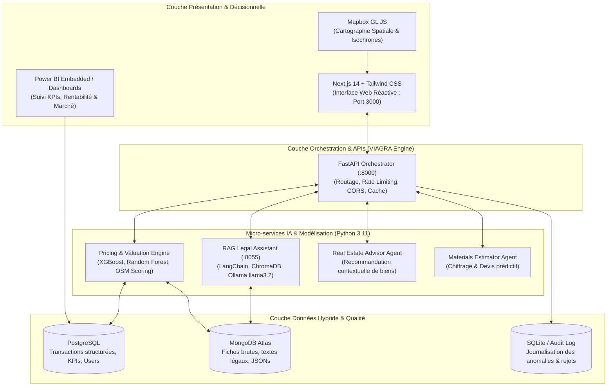

# 🏢 EstateMind — Plateforme d'Intelligence & Analyse Immobilière Tunisienne
### Multi-Agent Orchestration • Dual-Valuation RAG • Price Prediction • OSM Geospatial Scoring • Next.js 14 & Power BI

[]()
[]()
[]()
[]()
[]()

> **Projet Intégré (PI) — 4<sup>e</sup> Année Data Science (4DS10) | ESPRIT School of Engineering (Année 2025–2026)**  
> **Conception & Architecture Data/IA :** Dhia Romdhane (*Lead Data & AI Architecture*) en collaboration avec l'équipe sprint NeuroNova.

---

## 1. Contexte & Problématique Métier

Le marché immobilier tunisien souffre traditionnellement d'une forte asymétrie d'information, de données transactionnelles fragmentées et non standardisées, et d'un manque de transparence sur la valorisation réelle des biens. 

**EstateMind** est une plateforme d'intelligence décisionnelle et prédictive de bout en bout qui transforme ces données brutes et hétérogènes en indicateurs fiables, explicables et exploitables par les investisseurs, promoteurs et particuliers :
1. **Fiabilisation & Qualité Industrielle des Flux :** Ingestion multi-sources automatisée, déduplication stricte et contrôle de cohérence à la source.
2. **Double Moteur de Valorisation (Dual-Valuation Engine) :** Prédiction du prix marché par Machine Learning supervisé (XGBoost / Random Forest) enrichie par un scoring géospatial multi-critères (OpenStreetMap).
3. **Système Multi-Agents & RAG Juridique :** Agents conversationnels spécialisés basés sur LLM local (*Ollama llama3.2*) et RAG pour l'assistance réglementaire (Loi de Finances tunisienne, fiscalité immobilière).
4. **Restitution Interactive & Décisionnelle :** Interface moderne Next.js 14, visualisations cartographiques Mapbox GL et tableaux de bord Power BI.

---

## 2. Architecture Système Globale

La solution repose sur une architecture modulaire découplée et conteneurisée :



---

## 3. Piliers Techniques & Réalisations d'Ingénierie

### A. Data Engineering, Qualité & Gouvernance des Données
- **Ingestion & Déduplication :** Collecte automatisée multi-plateformes (Mubawab, plateformes d'annonces, bases ouvertes). Fenêtre de déduplication temporelle et hachage combiné `(titre, surface, localisation, prix)`.
- **Règles de Qualité Formalisées (Data Quality) :**
  - *Complétude :* Rejet ou imputation maîtrisée des valeurs aberrantes (surfaces < 10m² ou > 10 000m² avec prix incohérents).
  - *Conformité de Schéma :* Validation stricte Pydantic à l'ingestion des APIs REST.
  - *Traçabilité & Audit Trail :* Journalisation systématique des flux rejetés avec horodatage, motif de non-conformité et historisation.
- **Stockage Hybride Relationnel / NoSQL :**
  - **PostgreSQL :** Schéma relationnel optimisé pour les métriques financières (prix/m², rendement locatif brut estimé, historique des transactions).
  - **MongoDB :** Stockage documentaire pour les descriptions textuelles non structurées, les métadonnées de scraping et les corpus juridiques RAG.

### B. Moteur Prédictif de Prix & Scoring Géospatial
- **Feature Engineering Avancé :** Extraction des caractéristiques intrinsèques (nombre de chambres, étage, ascenseur, standing) et enrichissement par calcul de distances réelles vers les points d'intérêt (POIs OpenStreetMap : écoles, transports, hôpitaux, plages).
- **Benchmark Algorithmique :** Évaluation comparative sur un dataset de plus de 15 000 annonces tunisiennes :
  - **XGBoost Regressor :** $R^2 \approx 0.88$, RMSE optimisé.
  - **Random Forest & Gradient Boosting :** Validation croisée 5-fold pour éviter le surapprentissage.
  - **Scoring d'Attractivité Multi-Critères :** Score composite calculé sur 100 intégrant la dynamique de prix locale et l'accessibilité urbaine.

### C. Multi-Agents & RAG Juridique (LangChain & Ollama)
- **Base de Connaissances Vectorielle :** Indexation des textes de loi régissant l'immobilier tunisien (notamment la Loi de Finances n°48-2024, fiscalité des résidents/non-résidents, autorisations du Gouverneur).
- **Architecture RAG Locale :** Inférence locale via **Ollama (modèle `llama3.2:3b`)** avec embeddings sémantiques, garantissant la confidentialité des requêtes et un coût d'exploitation nul en production.

### D. Frontend Moderne Next.js 14 & Visualisation
- **Stack UI :** Next.js 14 (App Router), TypeScript, Tailwind CSS, composants Lucide-React.
- **Cartographie Interactive :** Couches spatiales Mapbox GL avec clusters, polygones de quartiers et fiches détaillées au survol.
- **Tableaux de Bord Décisionnels :** Visualisation des tendances de prix par gouvernorat (Tunis, Ariana, Sousse, Sfax, Nabeul) et simulateur de retour sur investissement (ROI).

---

## 4. Structure du Répertoire

```plaintext
EstateMind/
├── backend/                      # API Backend & services de persistance
│   ├── src/                      # Contrôleurs, routes, connecteurs bases de données
│   └── Dockerfile
├── frontend/                     # Application web Next.js 14
│   ├── src/app/                  # Pages : /predict, /map, /legal, /advisor, /listings
│   ├── public/                   # Assets graphiques, modèles 3D
│   └── package.json
├── viagra/                       # VIAGRA Orchestrator (FastAPI central)
│   ├── main.py                   # Point d'entrée de routage des micro-services IA
│   └── requirements.txt
├── dhia/                         # Modules Data Science & Pricing (Dhia Romdhane)
│   ├── academic_evaluation.py    # Suite de métriques de validation académique
│   ├── predict_investment.py     # Moteur de scoring ROI et valorisation
│   ├── rag_backend.py            # Moteur RAG & connecteurs vectoriels
│   ├── Property-Prices-in-Tunisia.csv # Dataset nettoyé et fiabilisé
│   └── run_pipeline.py           # Pipeline ETL de nettoyage et d'inférence
├── services/                     # Micro-services conteneurisés additionnels
├── docker-compose.yml            # Déploiement multi-conteneurs local
├── docker-compose.azure.yml      # Déploiement optimisé pour machine virtuelle Azure
├── nginx.azure.conf              # Configuration Reverse Proxy Nginx & SSL
├── start-dev.bat                 # Script de démarrage rapide sous Windows
│
├── README.md                     # Documentation générale (ce document)
├── ARCHITECTURE.md               # Spécifications d'architecture système détaillées
├── TECHNICAL_ARCHITECTURE.md     # Architecture technique des flux et protocoles
├── VIAGRA_ORCHESTRATION.md       # Spécification du moteur d'orchestration
├── ESTATEMIND-FULL-GUIDE.md      # Guide opérationnel complet de déploiement
└── AZURE-DEPLOYMENT.md           # Procédure de mise en production Cloud Azure
```

---

## 5. Démarrage Rapide (Environnement Local)

### Prérequis
- **Python 3.10+** et `pip`
- **Node.js 18+** et `npm`
- **Docker & Docker Compose** (recommandé)

### Option 1 — Démarrage Automatique (Windows)
Double-cliquez sur `start-dev.bat` ou lancez en ligne de commande :
```bash
.\start-dev.bat
```

### Option 2 — Démarrage Manuel par Service
1. **Configurer l'environnement :**
   ```bash
   cp .env.example .env
   ```
2. **Lancer le Frontend (Next.js) :**
   ```bash
   cd frontend
   npm install
   npm run dev
   # Accessible sur http://localhost:3000
   ```
3. **Lancer l'Orchestrateur IA (FastAPI) :**
   ```bash
   cd viagra
   pip install -r requirements.txt
   python main.py
   # Accessible sur http://localhost:8000 (Swagger docs : /docs)
   ```

### Option 3 — Démarrage Conteneurisé (Docker Compose)
```bash
docker-compose up --build -d
```

| Service | Port | Description |
|---|---|---|
| **Frontend Web** | `3000` | Application principale Next.js |
| **Orchestrateur VIAGRA** | `8000` | Passerelle API REST FastAPI |
| **Backend Persistance** | `5000` | API Node/Express & Gestion des annonces |
| **Documentation API** | `8000/docs` | Documentation interactive Swagger/OpenAPI |

---

## 6. Déploiement Cloud (Microsoft Azure)

Le projet intègre une configuration complète pour le déploiement sur une machine virtuelle Ubuntu sous Microsoft Azure :
- Script d'automatisation : `deploy-azure.sh`
- Configuration Docker dédiée : `docker-compose.azure.yml`
- Reverse Proxy Nginx avec routage des sous-domaines et certificats SSL : `nginx.azure.conf`
- Documentation pas-à-pas : consulter [AZURE-DEPLOYMENT.md](AZURE-DEPLOYMENT.md).

---

## 7. Contributeurs & Remerciements

Ce projet est le fruit du travail de l'équipe **NeuroNova** dans le cadre du Projet Intégré 4DS10 à **ESPRIT School of Engineering** :

- **Dhia Romdhane** — *Lead Data & AI Architecture, Pricing Engine, RAG & Data Quality* ([GitHub](https://github.com/dhia10))
- **Nour Rajhi** — *Scraping Infrastructure & Legal Agent Lead*
- **Yosri Awedi** — *Frontend Coordination & AI Engine Integration*
- **Oumaima Nacef** — *Market Analytics & Data Modeling*
- **Baha Saadaoui** — *Real Estate Advisor Conversational Agent*
- **Taha Yassine Bouguerra** — *3D Spatial & Visualization Modules*

### Encadrement académique :
Nous remercions chaleureusement le corps professoral et les coordinateurs du département Data Science d'**ESPRIT (Tunisie)** pour leur accompagnement méthodologique tout au long de ce projet.
