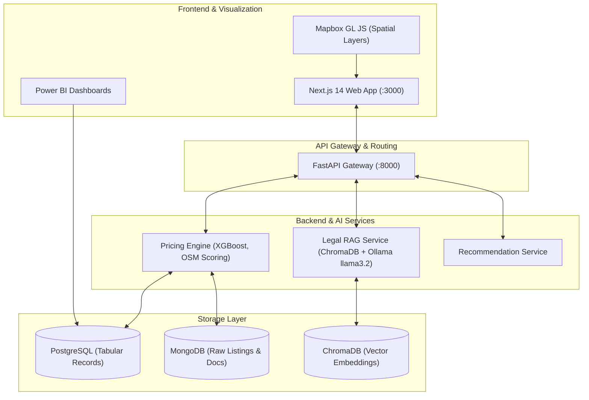

# EstateMind — Real Estate Analytics & AI Platform

Modular platform combining machine learning price prediction, spatial scoring, and a localized legal RAG assistant for the Tunisian real estate market.

> **Integrated Project (PI) — 4th Year Data Science (4DS10) | ESPRIT School of Engineering (2025–2026)**  
> **Data & AI Architecture:** Dhia Romdhane (*Lead Data & AI Architecture*) in collaboration with team NeuroNova.

---

## 1. Problem Statement & Architecture

Real estate transaction data in emerging markets is typically fragmented across unstructured portals, with limited price transparency and complex regulatory frameworks. 

**EstateMind** provides an end-to-end analytics workflow:
1. **Multi-Source Scraping & Ingestion:** Collects and standardizes listing feeds across Tunisian property portals.
2. **Hybrid Storage Backend:**
   - **PostgreSQL:** Structured transaction records, calculated metrics (price/m², ROI), and clean tabular data.
   - **MongoDB:** Unstructured listing descriptions, dynamic attributes, and raw JSON payloads.
3. **Price Prediction & Spatial Scoring:** XGBoost regression model trained on cleaned listings, augmented with OpenStreetMap (OSM) proximity distances (transport, schools, commercial zones).
4. **Local Legal RAG Assistant:** Question-answering agent over Tunisian real estate regulations and tax law (Finance Act), running locally via **Ollama (`llama3.2`)** and **ChromaDB** with strict prompt grounding to eliminate hallucination risks.
5. **Interactive UI:** Next.js 14 web application with Mapbox GL visualizations and Power BI dashboards.

---

## 2. System Architecture



---

## 3. Engineering Details

### Data Cleaning & Storage Pipeline
- **Validation:** Pydantic models validate listing schemas at ingestion. Outlier filters reject impossible surfaces (<10 m² or >10,000 m²) and inconsistent price-per-square-meter ratios.
- **Deduplication:** Hash-based deduplication on `(title, surface, location, price)` reduces redundant entries from cross-posted listings.
- **Relational / Document Split:** Financial metrics, user preferences, and structured attributes reside in PostgreSQL; variable listing fields and raw scraped text reside in MongoDB.

### Machine Learning Price Prediction
- **Algorithm:** XGBoost Regressor trained on 15,000+ cleaned property records.
- **Features:** Surface area, bedroom count, floor, geographic coordinates, and Euclidean/network distance to essential POIs (OpenStreetMap).
- **Validation:** 5-fold cross-validation with RMSE and $R^2$ tracking to prevent overfitting on premium outliers.

### Legal RAG Assistant (Local Inference)
- **Knowledge Base:** Indexed corpus of Tunisian property tax laws, tenant rights, and foreign buyer regulations.
- **Vector Search:** Chunked text indexed in ChromaDB using semantic embeddings.
- **Model:** Local inference with Ollama `llama3.2:3b`. Guardrails enforce strict document grounding: answers must cite retrieved legal articles or decline to answer.

---

## 4. Repository Structure

```
EstateMind/
├── backend/                  # Database connectors & REST endpoints
├── frontend/                 # Next.js 14 web client (App Router, Tailwind CSS)
│   ├── src/app/              # Routes: /predict, /map, /legal, /advisor
│   └── package.json
├── dhia/                     # Data processing, pricing model, and evaluation scripts
│   ├── Property-Prices-in-Tunisia.csv  # Cleaned benchmark dataset
│   ├── predict_investment.py # ROI scoring & pricing inference
│   ├── rag_backend.py        # ChromaDB & Ollama interface
│   └── run_pipeline.py       # End-to-end cleaning and training pipeline
├── gateway/                  # FastAPI gateway router
│   ├── main.py
│   └── requirements.txt
├── docker-compose.yml        # Multi-container local orchestration
└── README.md
```

---

## 5. Quick Start (Local Setup)

### Prerequisites
- **Python 3.10+**
- **Node.js 18+**
- **Ollama** (with `ollama pull llama3.2:3b`)

### 1. Start AI Gateway & Services

```bash
cd gateway
pip install -r requirements.txt
uvicorn main.py --host 0.0.0.0 --port 8000 --reload
```

### 2. Start Frontend

```bash
cd frontend
npm install
npm run dev
```

Open `http://localhost:3000` in your browser.

---

## 6. Contributors

Project built by the **NeuroNova** team during the 4DS10 Integrated Project at **ESPRIT School of Engineering**:

- **Dhia Romdhane** — *Lead Data & AI Architecture, Pricing Engine, RAG & Data Quality* ([GitHub](https://github.com/dhia10) • [LinkedIn](https://www.linkedin.com/in/dhia-romdhane-ds/))
- **Nour Rajhi** — *Scraping Infrastructure & Legal Agent Lead*
- **Yosri Awedi** — *Frontend Coordination & AI Integration*
- **Oumaima Nacef** — *Market Analytics & Data Modeling*
- **Baha Saadaoui** — *Conversational Advisor Module*
- **Taha Yassine Bouguerra** — *3D Spatial & Map Visualizations*

---

## License

Academic and educational use.